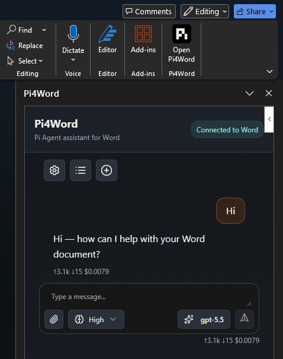

# Pi4Word

**Pi4Word** is a Microsoft Word task pane add-in that embeds a Pi Agent-powered assistant using [`@mariozechner/pi-agent-core`](https://www.npmjs.com/package/@mariozechner/pi-agent-core).

<p align="center">
  
</p>

For architecture, runtime behavior, tools, storage, and streaming details, see [SPECS.md](./SPECS.md).

## Manifests

| File | Purpose | Task pane URL |
| --- | --- | --- |
| `manifest.xml` | Local development and Word sideloading | `https://localhost:3000/public/index.html` |
| `manifest.production.xml` | Production usage in Word | `https://damianofalcioni.github.io/pi-for-word/public/index.html` |

## Requirements

- Node.js and npm
- Desktop Microsoft Word for local sideloading
- HTTPS on `https://localhost:3000` for local development

On Windows, `npm run cert` creates the local TLS material expected by `npm run serve`.

## Local Development

```bash
npm install
npm run build
npm run cert
npm run word
```

`npm run word` starts the HTTPS dev server and sideloads `manifest.xml` into Word.

## Build

```bash
npm run build
```

The build runs tests, linting, and `scripts/esbuild.mjs`. Output is written to `public/`, including:

- `public/index.html`
- `public/index.min.js`
- `public/index.min.css`
- copied runtime assets under `public/assets/` and `public/pdfjs-dist/`

## Production Usage

Use [`manifest.production.xml`](https://damianofalcioni.github.io/pi-for-word/manifest.production.xml) to load the production add-in in Word. This manifest points Word to the public GitHub Pages build at `https://damianofalcioni.github.io/pi-for-word/public/`.

### Word on Windows

1. Copy [`manifest.production.xml`](https://damianofalcioni.github.io/pi-for-word/manifest.production.xml) to a folder that Word can use as a shared add-in catalog.
2. In Word, open **File > Options > Trust Center > Trust Center Settings > Trusted Add-in Catalogs**.
3. Add the folder path as a trusted catalog, select **Show in Menu**, then restart Word.
4. Open **Home > Add-ins > Shared Folder**, select **Pi4Word**, and add it to the document.

### Word on the Web

1. Open a document in Word on the web.
2. Open **Insert > Add-ins > More Add-ins**.
3. Choose **Upload My Add-in**.
4. Select [`manifest.production.xml`](https://damianofalcioni.github.io/pi-for-word/manifest.production.xml).

After the add-in is loaded, use **Open Pi4Word** from the Word ribbon.

## Scripts

| Command | Description |
| --- | --- |
| `npm run cert` | Creates local HTTPS certificate material on Windows. |
| `npm run serve` | Serves the repository over HTTPS on port `3000`. |
| `npm run word` | Starts Word sideloading with `manifest.xml`. |
| `npm run test` | Runs Node tests. |
| `npm run eslint` | Runs ESLint. |
| `npm run esbuild` | Bundles the task pane into `public/`. |
| `npm run build` | Runs tests, linting, and bundling. |

## License

MIT
